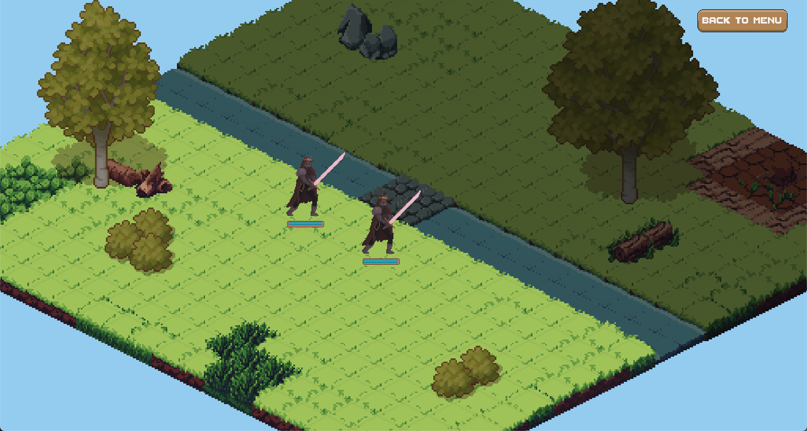
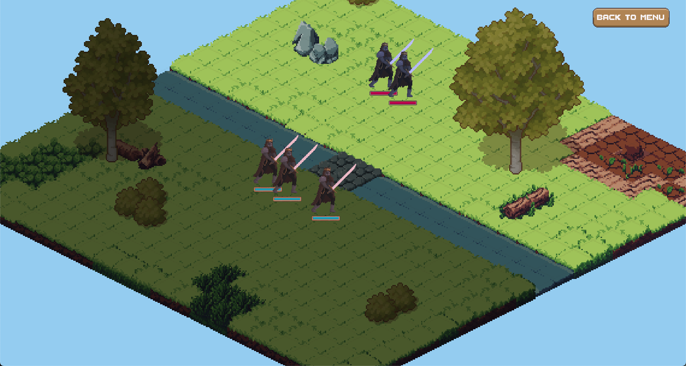
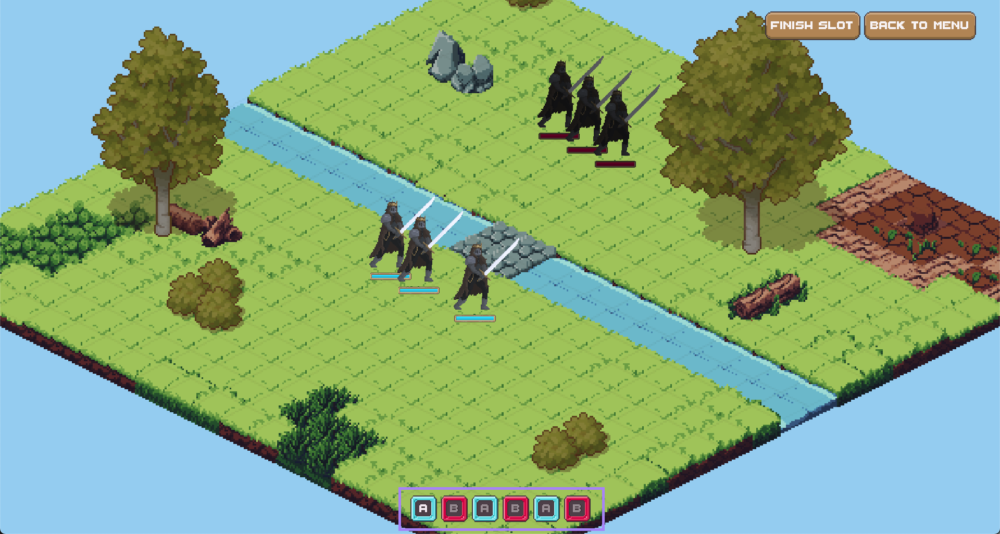
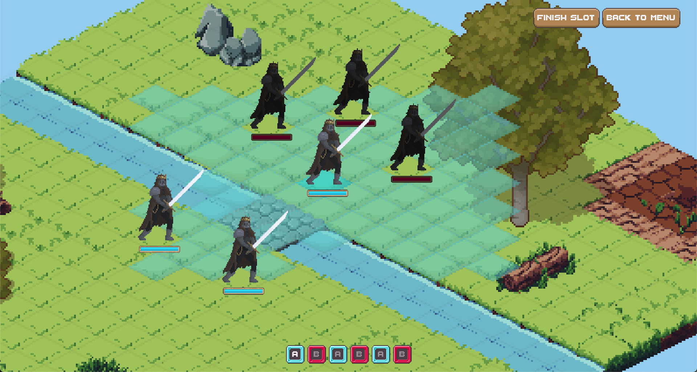
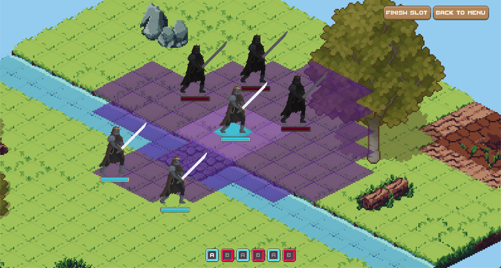
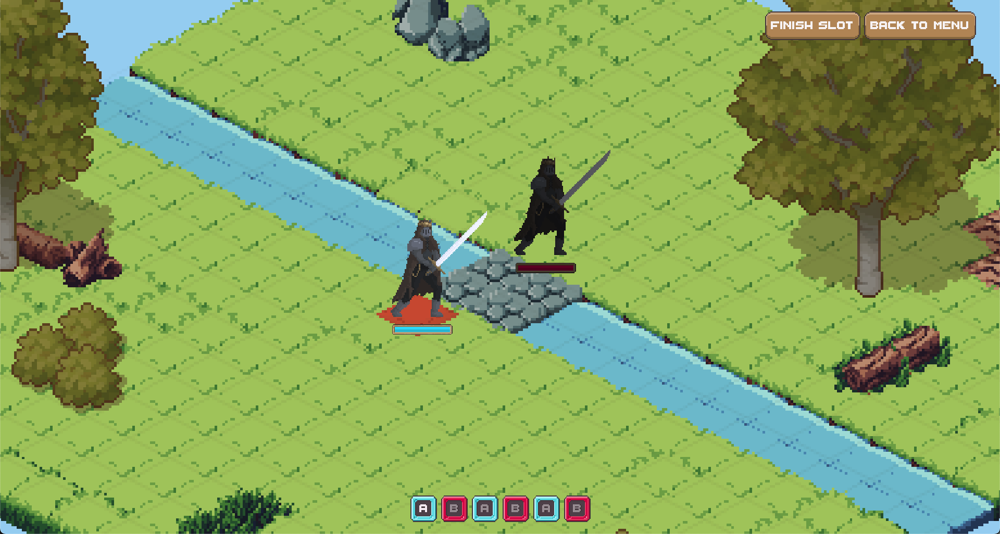
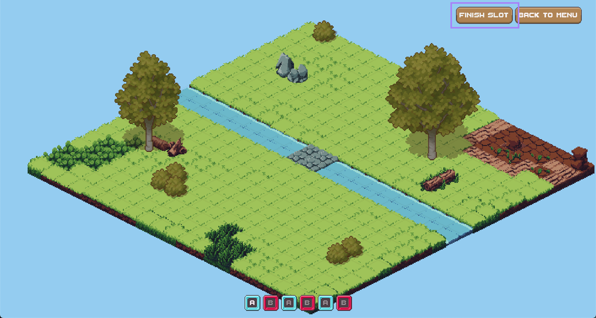
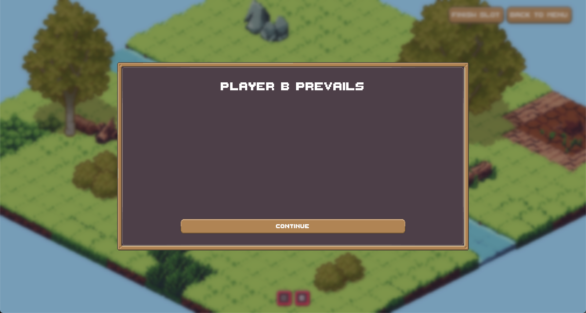

# Heralds of War

2D turn-based strategy game made in Godot.

## Authors

- [Jakub Szaredko](https://github.com/Szaroslav)
- [Piotr Kuchta](https://github.com/kpiotr6)
- [Mateusz Knap](https://github.com/MatoKnap)

## Game Mode

**Heralds of War** supports a single mode: **hotseat for 2 players**.
Players choose from several pre-designed maps. Each player places their pool of units on their team’s designated area of the map. The game then proceeds to the main phase.

## Game Mechanics

The map is displayed in an **isometric grid** of square tiles.
Each tile can contain objects that affect gameplay:

- **Blocking elements:** trees, bushes, rocks — units cannot enter these tiles.
- **Special elements:** e.g., rivers — increase movement cost and force strategic planning.

### Map

- Square tiles in isometric projection.
- Blocking and special elements impact unit movement and stamina.

### Combat System

Players take turns in an alternating loop.
A turn consists of **sequences**, with the number equal to the number of surviving units. Sequences alternate between players (e.g., `ABABAB`).
Unlocking a sequence lets the player perform any number of actions with one unit until its stamina is depleted.

- **Actions:** Move or attack.
- **Stamina:** Each unit has its own stamina pool. Actions consume stamina. At the end of a turn, stamina is fully refreshed.

## Units

Units can move in all directions with a **diamond-shaped range**.
Movement range depends on stamina and terrain.

**Unit stats:**

- **Health:** Damage a unit can take.
- **Stamina:** Total action cost limit per turn.
- **Attack Power:** Damage dealt to enemy health.
- **Attack Cost:** Stamina used for attacking.
- **Defense:** 0–100, reduces incoming damage by a percentage.

**Available unit:**
**Swordsman**

- Health: 100 pts
- Stamina: 60 pts
- Attack Power: 50 pts
- Attack Cost: 20 pts
- Defense: 0 pts

## How to Play

### Start Game

Click **START GAME**, then choose a map with different terrain layouts and units.

### Placement Phase

Each player places units on their highlighted starting area.

- **LMB** — place unit on tile.
- After _player A_ finishes, the game switches to _player B_.

_Player A placement_

_Player B placement_

---

### Main Game Phase

- Highlighted units — active team for current sequence.
- Player label (A/B) matches highlighted sequence at the bottom.
  
  _Turn sequence `ABABAB`_

---

**Move Unit:**

- **LMB** — select unit.
- Blue tiles — available movement.
- **LMB** on blue tile — move.
- **LMB** elsewhere or **RMB** — deselect.

_Unit movement preview_

---

**Attack:**

- **RMB** — select unit for attack mode.
- Dark purple tiles — direct attack.
- Light purple tiles — attack after moving.
- **LMB** on highlighted tile — attack.

_Attacking and unit attack range preview_

---

**Remaining Stamina:**

- Units with remaining stamina have a red base.
  
  _An active unit_

- If no stamina remains, next sequence starts automatically.

- End a sequence early with **FINISH SLOT** (top-right).
  
  _Finish slot button_

## End Game

The game ends when all units of a team are defeated.

_End game — player B wins_
